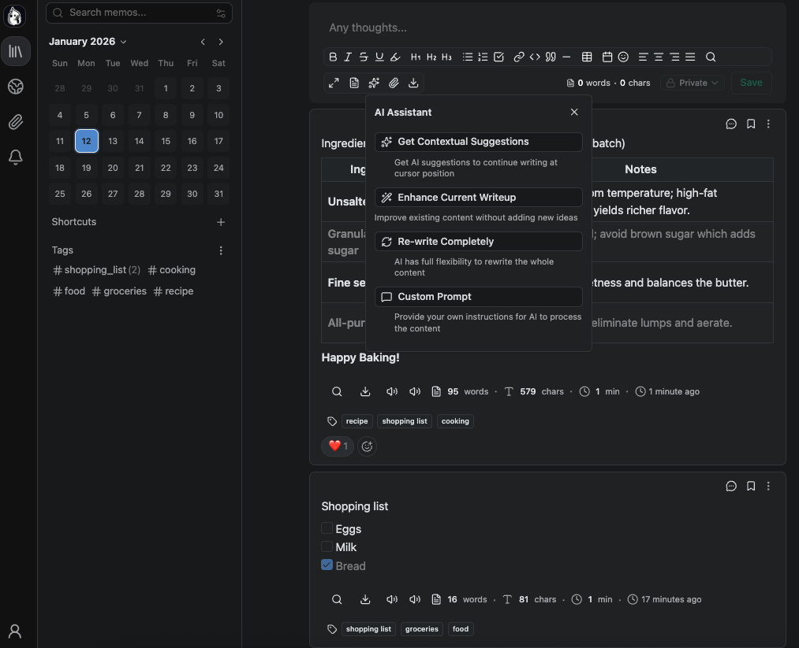

# Memos

An open-source, self-hosted note-taking service. Your thoughts, your data, your control — no tracking, no ads, no subscription fees.

Based on some awesome codebase https://github.com/usememos/memos
To be honest all hard work was already done, I just sprinkled some seasonings on top!



## Overview

Memos is a privacy-first, self-hosted knowledge base that works seamlessly for personal notes, team wikis, and knowledge management. Built with Go and React, it offers lightning-fast performance without compromising on features or usability.

**Why choose Memos over cloud services?**

| Feature           | Memos                          | Cloud Services                |
| ----------------- | ------------------------------ | ----------------------------- |
| **Privacy**       | ✅ Self-hosted, zero telemetry | ❌ Your data on their servers |
| **Cost**          | ✅ Free forever, MIT license   | ❌ Subscription fees          |
| **Performance**   | ✅ Instant load, no latency    | ⚠️ Depends on internet        |
| **Ownership**     | ✅ Full control & export       | ❌ Vendor lock-in             |
| **API Access**    | ✅ Full REST + gRPC APIs       | ⚠️ Limited or paid            |
| **Customization** | ✅ Open source, forkable       | ❌ Closed ecosystem           |

## Features

- **🔒 Privacy-First Architecture**

  - Self-hosted on your infrastructure with zero telemetry
  - Complete data ownership and export capabilities
  - No tracking, no ads, no vendor lock-in

- **📝 Markdown Native**

  - Full markdown support with syntax highlighting
  - Plain text storage — take your data anywhere
  - Customizable templates with date placeholders
  - Inline formatting toolbar

- **🤖 AI-Powered Features**

  - **AI Tag Generation** - Automatically generate relevant tags using Ollama
  - **AI Writing Assistant** - Contextual suggestions, rewrite, and enhance content
  - **Custom AI Prompts** - Configure AI behavior via ConfigMaps
  - **Tag Reuse** - Smart tag matching to minimize tag proliferation
  - Supports any Ollama-compatible models (Llama, Mistral, GPT, etc.)

- **💬 Comments & Collaboration**

  - Inline comment system for discussions
  - Real-time comment updates
  - Comment threading support

- **🔊 Text-to-Speech**

  - Read memos aloud with natural-sounding voices
  - Multiple voice options (male/female, premium voices)
  - Play/pause controls and voice selection
  - Optimized for story-like reading experience

- **⚡ Blazing Fast**

  - Built with Go backend and React frontend
  - Optimized for performance at any scale
  - Lazy-loaded images with Intersection Observer
  - Efficient React Query caching

- **🐳 Simple Deployment**

  - One-line Docker installation
  - Supports SQLite, MySQL, and PostgreSQL
  - Kubernetes ConfigMap support for configuration
  - Environment variable configuration

- **🔗 Developer-Friendly**

  - Full REST and gRPC APIs
  - Easy integration with existing workflows
  - Configurable templates and AI prompts
  - File-based configuration (supports ConfigMaps)

- **🎨 Beautiful Interface**
  - Clean, minimal design with multiple themes
  - Dark mode and custom theme support
  - Mobile-responsive layout with optimized toolbar
  - Inline forms (no popups) for better UX

## Quick Start

### Docker (Recommended)

```bash
docker run -d \
  --name memos \
  -p 5230:5230 \
  -v ~/.memos:/var/opt/memos \
  -e MEMOS_MODE=prod \
  -e OLLAMA_BASE_URL=http://localhost:11434 \
  -e OLLAMA_MODEL=llama3:8b \
  neosmemo/memos:stable
```

Open `http://localhost:5230` and start writing!

**Environment Variables:**
- `MEMOS_MODE` - Server mode (`prod`, `dev`, `demo`)
- `MEMOS_PORT` - HTTP port (default: `8081`)
- `MEMOS_DATA` - Data directory path
- `MEMOS_DRIVER` - Database driver (`sqlite`, `mysql`, `postgres`)
- `MEMOS_DSN` - Database connection string
- `MEMOS_INSTANCE_URL` - Public URL of your instance
- `OLLAMA_BASE_URL` - Ollama API URL (default: `http://localhost:11434`)
- `OLLAMA_MODEL` - Default Ollama model (default: `gpt-oss:120b`)

### Documentation

- **[Features Guide](docs/FEATURES.md)** - Complete overview of all features including AI, text-to-speech, comments, and more
- **[Configuration Guide](docs/CONFIGURATION_GUIDE.md)** - How to configure templates, AI prompts, and environment variables
- **[Configuration Reference](docs/CONFIGURATION.md)** - Detailed configuration options and API endpoints

### Other Installation Methods

- **Docker Compose** - Recommended for production deployments
- **Kubernetes** - Complete manifests available in [`k8s/`](k8s/) directory
- **Pre-built Binaries** - Available for Linux, macOS, and Windows
- **Build from Source** - For development and customization

**Kubernetes Deployment:**
```bash
# Quick deploy with kustomize
kubectl apply -k k8s/

# Or deploy individually
kubectl apply -f k8s/namespace.yaml
kubectl apply -f k8s/configmap.yaml
kubectl apply -f k8s/pvc.yaml
kubectl apply -f k8s/deployment.yaml
kubectl apply -f k8s/service.yaml
kubectl apply -f k8s/ingress.yaml
```

See [`k8s/README.md`](k8s/README.md) for detailed Kubernetes deployment instructions.

## Contributing

We welcome contributions of all kinds! Whether you're fixing bugs, adding features, improving documentation, or helping with translations — every contribution matters.

## License

Memos is open-source software licensed under the [MIT License](LICENSE).

